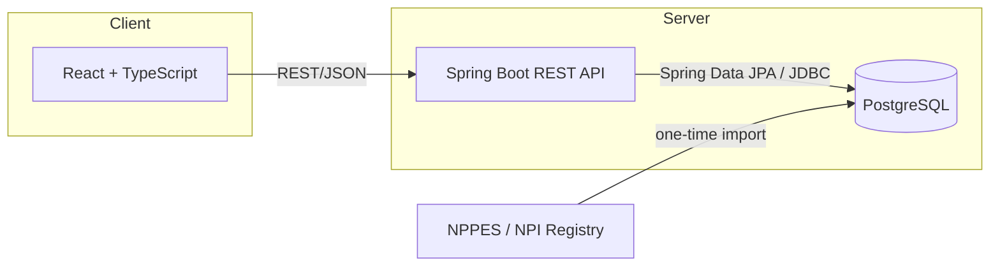

# DocFit AI

A healthcare **navigation** tool that helps people find nearby providers by specialty and
location, using real public provider data.

## What it does

DocFit AI lets you search for healthcare providers by specialty (Primary Care, Cardiology,
Dermatology, Orthopedics, Psychiatry / Mental Health), then by ZIP code, city, or your current
location. Results are sorted by distance (or name), filterable by search radius, and can be
compared side by side. Every provider record traces back to real NPPES/NPI data — nothing is
fabricated.

## Why it exists

Finding an in-network, nearby provider usually means bouncing between multiple directory
websites, most of which are slow, cluttered, or out of date. DocFit AI is a from-scratch
exercise in building a small, honest version of that discovery experience end to end: real
data, a real search/filter/compare flow, and clear limits on what the product actually knows
(distance is approximate, insurance is not verified).

## Current features

- Specialty search across 5 specialty groups, backed by verified NUCC taxonomy mappings
- Location search by ZIP code, city name (e.g. "Long Beach" or "Long Beach, CA"), or the
  browser Geolocation API ("Use my location")
- Local location suggestions as you type (no external geocoder)
- Adjustable search radius (5 / 10 / 25 / 50 miles), applied server-side
- Haversine-based approximate distance, nearest-first or name A–Z/Z–A sorting, pagination
- Shareable/bookmarkable search URLs (specialty, location, radius, sort, and page all live in
  the URL; browser Back/Forward and page refresh reproduce the same search); a "Share search"
  button copies the link
- Provider detail page (`/providers/:id`) with full taxonomy information, distance from the
  active search, and working Call / Get Directions actions
- Provider comparison (`/compare`) for up to 3 providers, side by side, factual fields only —
  no ratings, quality claims, or clinical recommendations
- Insurance carrier selection, clearly labeled as demo/informational only — it is never sent to
  the search API and never implies a provider accepts a given plan
- Responsive, accessible UI: keyboard-navigable mobile menu, focus-visible states, `aria-live`
  search status, `prefers-reduced-motion` support
- Provider name search ("Already know who you're looking for?") for finding a specific provider
  directly, without a specialty/location search
- Optional free account (email + password): sign in/register with the access token kept in
  memory only (never `localStorage`) and a rotating, revocable `httpOnly` refresh cookie
- Saved providers: an explicit heart/save toggle on any provider card or detail page, viewable at
  `/saved`. Signing in is never required to search — only to save.
- Saved searches: an explicit "Save this search" action in the results toolbar, viewable at
  `/saved-searches`. DocFit AI never records a search automatically.
- Recently viewed providers: kept in `sessionStorage` only, cleared by the user or when the tab
  closes, and never sent to the server
- Provider detail data provenance ("Imported into DocFit AI on...") sourced from a real,
  database-populated `imported_at` timestamp — never a fabricated date
- "Find care by specialty" homepage shortcuts and an "Explore care near you" area explorer, both
  driven by real backend reference data (the 5 supported specialties, the demo-area ZIP
  geography) — clicking either pre-fills the search form rather than showing hardcoded content
- "Why this result?" on every provider card and detail page: a factual, expandable explanation
  (matched specialty, approximate distance, NPPES/NPI data source, insurance-not-verified) —
  never a score, rank, or "best match" claim

## What it deliberately does not do

DocFit AI is healthcare **navigation** software. It does not diagnose conditions, interpret
symptoms, recommend treatment or medication, or give clinical advice of any kind. It does not
show fabricated ratings, reviews, "verified" badges, availability, or provider photos, and it
does not claim insurance acceptance without a real compatibility source.

## Tech stack

**Backend**
- Java 21
- Spring Boot (Web, Data JPA, Validation, Security)
- JJWT (`io.jsonwebtoken`) for access-token signing — a well-supported library, not hand-rolled
  cryptography
- PostgreSQL
- Flyway (schema + reference-data migrations)
- Maven

**Frontend**
- React 19 + TypeScript
- Vite
- React Router (client-side routing for search, provider detail, comparison, and account pages)

**Infrastructure**
- Docker (PostgreSQL via `docker-compose.yml`)
- GitHub Actions CI (backend `mvnw verify`, frontend typecheck/lint/test/build)

## Architecture



The backend follows Controller → Service → Repository, with DTOs at the API boundary (JPA
entities are never returned directly). Reference data (specialties, NUCC taxonomy codes,
insurance carriers, ZIP geography) and provider data (imported from NPPES) live in separate
Flyway-managed table groups.

## Data

- **Providers**: imported once from the public [NPI Registry / NPPES API](https://npiregistry.cms.hhs.gov/),
  filtered to individual (NPI-1) providers whose taxonomy matches one of DocFit AI's supported
  specialties. The import is a manual, one-time `CommandLineRunner` gated behind a Spring
  profile — not a scheduled job.
- **Geography**: a small, intentionally limited demo set of ZIP codes covering Long Beach and
  nearby Los Angeles County (90802, 90803, 90806, 90815, 90712, 90755), sourced from U.S. Census
  ZCTA reference data. Location search and suggestions only work within this demo area.
- **Insurance**: a static list of well-known carrier names for the insurance dropdown. Selecting
  a carrier is informational only — DocFit AI has no real insurance-compatibility data source,
  and the UI/API never imply a provider accepts a given plan.
- **Distance**: an approximate straight-line (Haversine) calculation, not driving distance or
  time.

## Running locally

### Prerequisites
Java 21, Node 22+, Docker Desktop.

### 1. Database
```
cp .env.example .env
docker compose up -d postgres
docker compose ps        # wait for "healthy"
```

### 2. Backend
```
cd backend
./mvnw spring-boot:run
```
Health check: `GET http://localhost:8080/actuator/health`

To run the one-time NPPES import (writes real provider data into your local database):
```
cd backend
./mvnw spring-boot:run -Dspring-boot.run.profiles=import
```

### 3. Frontend
```
cd frontend
npm ci
npm run dev
```
Open `http://localhost:5173`. It talks to the backend via `VITE_API_BASE_URL`, which defaults
to `http://localhost:8080` (see `frontend/.env.example`).

### Auth environment variables (backend)

All have safe local defaults (see `backend/src/main/resources/application.properties`); override
via environment variables for anything beyond local dev:

| Variable | Default (local only) | Notes |
|---|---|---|
| `JWT_SECRET` | an insecure placeholder | **Must** be overridden (256+ bit random value) outside local dev |
| `ACCESS_TOKEN_TTL_MINUTES` | `15` | Access token lifetime |
| `REFRESH_TOKEN_TTL_DAYS` | `30` | Refresh token lifetime |
| `AUTH_COOKIE_SECURE` | `false` | Set `true` in any real (HTTPS) deployment |
| `AUTH_RATE_LIMIT_MAX_ATTEMPTS` / `AUTH_RATE_LIMIT_WINDOW_MINUTES` | `10` / `5` | In-memory, per-IP+email sliding-window limiter on register/login — single-instance only, not distributed (documented limitation, not a bug) |

> **Windows PowerShell note:** if `npm` is blocked by PowerShell's script-execution policy
> (`npm.ps1 cannot be loaded...`), use `npm.cmd` instead (e.g. `npm.cmd install`,
> `npm.cmd run dev`), or run the commands from Git Bash / WSL instead of native PowerShell.

## Testing

**Backend** (from `backend/`):
```
./mvnw --batch-mode verify
```

**Frontend** (from `frontend/`):
```
npm run typecheck
npm run lint
npm run test
npm run build
```

## Screenshots

Not included in this repository. If you'd like to see the UI, run it locally (above) — the
search flow, provider cards, detail page, and comparison view are all fully functional.

## Roadmap

Reasonable future directions, not yet built:

- Legitimate insurance-compatibility integration (a real data source, not a static list)
- Expanded provider geography beyond the current Long Beach / LA demo area
- Richer provider profiles (hours, languages, accepting-new-patients where reliably sourced)
- Provider availability integration, only where a reliable data source exists
- Password reset (deliberately not implemented yet — no "Forgot password" link is shown rather
  than promising a flow that doesn't work)
- A real map view, if one can be built without implying more location precision than the demo
  ZIP-centroid geography actually has

## Healthcare boundary

DocFit AI is healthcare **navigation** software. It does not provide diagnosis, treatment,
medication, or clinical advice of any kind. Always confirm provider and insurance details
directly with the provider or insurer.
