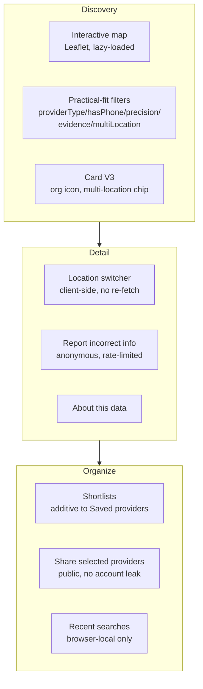

# Care Discovery V3

Companion docs: `docs/map-and-location-accuracy.md`, `docs/shortlists.md`,
`docs/directory-corrections.md`, `docs/geospatial-scaling.md` (backend distance implementation
this phase builds on), `API.md` (endpoint reference). This document is the phase overview: what
changed, why, and how the pieces fit together.

## Mission

The product question DocFit AI answers moved from "which providers are near me?" to "which nearby
options fit my practical needs, where are they located, why are they shown, and how can I make a
useful shortlist?" -- deliberately still not "which provider is best" (CLAUDE.md's hard scope
boundary: no clinical quality, no ratings, no diagnosis, no fabricated availability/coverage).

## What was built

- **Interactive map** -- `docs/map-and-location-accuracy.md`. Leaflet + OpenStreetMap, no paid API.
  Precision-aware markers, desktop split-view / mobile toggle, lazy-loaded chunk.
- **Practical-fit filters** -- backend (`ProviderSearchService`, additive/off-by-default,
  batched not N+1) + frontend (`PracticalFitFilterBar`). See `API.md` for the five filter params.
- **Card V3** -- organization building icon instead of a fake avatar, "N practice locations" chip,
  a factual phone-availability line added to the existing `WhyThisResult` panel rather than a
  second, largely-duplicate "practical fit" block.
- **Location switcher** -- every office's full data arrives in one detail response; switching is
  pure client state, no extra request. Network evidence (the one thing that's genuinely
  location-specific server-side) re-fetches correctly on switch.
- **Directory correction reports** -- `docs/directory-corrections.md`. Anonymous, rate-limited,
  never auto-applied to provider data.
- **Shortlists** -- `docs/shortlists.md`. Additive to the existing saved-providers list, full
  ownership-scoped CRUD, IDOR-tested.
- **Share selected providers** -- a public `/share/providers?ids=...` link, no backend sharing
  table, never leaks account/shortlist context.
- **Recent searches** -- browser-local (sessionStorage) only, mirrors the existing
  Recently-Viewed-Providers pattern; never sent to the server.

## What was deliberately not built

- **No AI/ML matching.** "Practical fit" stayed fully deterministic (CLAUDE.md "No Fake AI") --
  the brand name containing "AI" was not treated as a reason to add a model where a plain filter
  suffices. See `docs/ai-navigation-opportunities.md` for research-only, explicitly-deferred ideas
  (natural-language administrative search parsing) -- not implemented, and never anything
  symptom/diagnosis-adjacent.
- **No numeric fit score.** Every "practical fit" surface (card, filters, `WhyThisResult`) is a
  factual checklist, never a percentage or composite score.
- **No provider ratings/reviews.** Out of scope by CLAUDE.md's standing rule, not reconsidered
  this phase.
- **No admin UI for directory reports.** Reports are a real, queryable database table; reviewing
  them today is a direct SQL query, documented rather than built as a UI (CLAUDE.md "Provider Data
  Report Admin -- Deferred UI").
- **No provider-notes field on shortlists.** Deliberately omitted to avoid inviting stored health
  context (`docs/shortlists.md` "No clinical notes field").

## Real bugs found only by running this in a browser

Every feature above was manually/E2E-verified against a live backend + real data, not just
type-checked and unit-tested. That process caught several real bugs a static check alone would
have missed -- documented in the relevant commit messages and `docs/release-checklist.md`-style
detail in each feature's own doc, but worth summarizing as a pattern: a map marker with no
explicit CSS size (invisible/unclickable despite Leaflet sizing its wrapper correctly), a filter
panel that got torn down mid-interaction by an unrelated loading-state branch, and two
Playwright-specific locator pitfalls (substring-matching ambiguity between new UI text and an
existing element; a `:not(.is-active)` selector whose meaning silently changed after the very
click it was asserting about). None of these were caught by `tsc`, ESLint, or Vitest -- all were
caught only by actually clicking through the feature in Chromium.

## Testing

- Backend: see `docs/release-checklist.md`-style counts in the phase's final report -- practical
  filters, shortlist CRUD/authorization/concurrency, and directory-report validation/rate-limiting
  all have dedicated test classes.
- Frontend: Vitest coverage for `recentSearches.ts`; component/page tests updated for the
  restructured provider detail page.
- E2E (Playwright, run against a live backend + real NPPES-imported data): map rendering and
  marker interaction, practical filters, the location switcher against a real 41-office provider,
  directory report submission, the full shortlist + share-selected workflow (including reading the
  real clipboard content and loading the public share page in a cookie-cleared context), recent
  searches, and keyboard accessibility of every new interactive component. All run multiple times
  consecutively with zero flakiness before being considered done.

## Privacy decisions, consolidated

- Shortlist names: private, never in the public share link.
- Directory reports: anonymous by default, rate-limited, never rendered back to any user.
- Recent searches: browser-local only, same guarantee as the pre-existing Recently Viewed feature.
- Share links: contain only public provider ids -- no account, shortlist name, saved state, or
  email, verified directly in `e2e/shortlists.spec.ts` by loading the share link in a
  cookie-cleared browser context.
