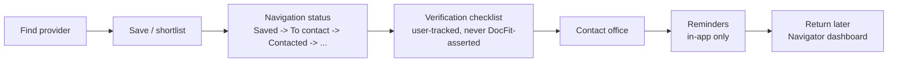

# Care Navigator V4

Companion docs: `docs/reminders.md`, `docs/user-data-export-and-deletion.md`, `API.md`
("Care Navigator"). This document is the phase overview: what changed, why, and how the pieces
fit together.

## Mission

DocFit AI already helped users **find**, **compare**, and **save** providers. Care Navigator adds
the next administrative step: **organize**, **contact**, **verify**, **follow up** -- without ever
crossing into medical decision-making. The differentiator is not "we rank doctors." It's: DocFit
organizes real provider information clearly, shows practical differences, explains why results
appear, shows where the data came from, lets users build a shortlist, and now also lets users
track their own administrative next steps -- while making uncertainty visible.

## What was built

- **Navigation status** -- a fixed, allowlisted, nonclinical status a user can assign to a saved
  provider: `SAVED`, `TO_CONTACT`, `CONTACTED`, `VERIFYING_DETAILS`, `SHORTLISTED`, `ARCHIVED`.
  Never "recommended," "approved," or a quality judgement. Setting a status also ensures the
  provider is on the plain saved-providers list (a status is meaningless for a provider the user
  isn't tracking at all).
- **Verification checklist** -- 6 fixed administrative items (location, phone,
  accepting-new-patients, insurance/network, appointment availability, expected cost) a user can
  mark `NOT_STARTED` / `NEEDS_CONFIRMATION` / `CONFIRMED_BY_USER` / `NOT_APPLICABLE`.
  `CONFIRMED_BY_USER` is rendered as "Marked confirmed by you," never "Verified" -- it is a private,
  per-user tracker, never written back into provider or network-evidence data, and never visible
  to any other user. See "User-confirmed vs. source data" below.
- **Reminders** -- `docs/reminders.md`. In-app-only follow-ups, no push/SMS/email.
- **Saved plan** -- explicit opt-in, one plan per user, references DocFit's own public payer/plan
  record only -- never a member ID, policy number, group number, DOB, or SSN.
- **Navigator dashboard** (`/navigator`) -- a factual summary (counts, never a score), a
  filterable/searchable list of saved providers each showing status, checklist progress, network
  evidence (if a plan is saved), and a deterministic "next action" label; shortlist summaries with
  per-status counts; the reminder panel; the saved-plan card; and saved searches.
- **Next action** -- a small, pure, rule-based function (`NextActionResolver`, unit-tested in
  isolation) that maps status + checklist state to a label like "Contact office" or "Confirm
  insurance." No AI, no model -- the "AI" in the brand name is not license to add one where a
  lookup table already solves the problem (consistent with `docs/ai-navigation-opportunities.md`).
- **Data export / account deletion** -- `docs/user-data-export-and-deletion.md`.
- **Provider detail integration** -- a navigation-status control (shown only once the provider is
  saved) and the same "Before you contact this provider" checklist, persisting for signed-in users
  and showing static (non-persisted) guidance for anonymous visitors.
- **Toast system** -- a minimal ARIA-live region (`ToastContext`) for routine confirmations
  ("Status updated," "Checklist updated," "Reminder created," "Plan saved," "Data downloaded").
  Critical errors (failed saves, failed loads) stay in their own visible panel -- never toast-only.

## User-confirmed vs. source data

The single most important product/privacy rule this phase: a user's own checklist confirmations
are **never** promoted into DocFit's provider or network-evidence data, and are **never** visible
to any other user. Concretely:

- `provider_verification_item` is keyed by `(user_id, provider_id, verification_type)` -- there is
  no code path anywhere that reads this table and writes to `provider`, `provider_location`, or
  `provider_network_evidence`.
- The UI copy is deliberately asymmetric: "Directory data / Source: NPPES" vs. "Your checklist /
  Marked confirmed by you" -- never blended into one claim.
- "Report incorrect information" (Care Discovery V3) remains available and independent -- marking
  a checklist item "confirmed" does not resolve or suppress a directory-correction report.

## Data model

Four new tables (V13 migration), all user-owned, all deleted on account deletion:

- `user_provider_navigation` -- `(user_id, provider_id)` unique, one status.
- `provider_verification_item` -- `(user_id, provider_id, verification_type)` unique, one status
  per item; `provider_location_id` nullable (a future per-location checklist hook, not required
  today since a provider's active location is client-side state).
- `user_reminder` -- `provider_id`/`shortlist_id` both optional and independent.
- `user_saved_plan` -- `user_id` unique (one plan per user, MVP simplicity).

## Authorization

Every endpoint resolves the acting user from the validated access token only, exactly like
shortlists/saved providers/saved searches before it. Covered by `NavigatorAuthorizationTest`
(HTTP-level: register two users, confirm one can never read or modify the other's navigation
status, checklist, reminders, saved plan, or exported data) and, at the service layer, by
per-feature test classes (`ReminderServiceTest`, `SavedPlanServiceTest`, `NavigatorServiceTest`).

## Performance

The dashboard is one aggregate endpoint, not one request per saved provider: navigation statuses,
verification items, and (if a plan is saved) network evidence are each fetched in one batched
query keyed by the caller's saved-provider ids, then joined in memory. The shortlist
to-contact/contacted breakdown is a single aggregate SQL query
(`GROUP BY shortlist_id, status`), not N per-shortlist queries.

## Real bugs found only by running this in a browser

Every feature above was manually and E2E-verified against a live backend + real data (Playwright,
`e2e/care-navigator.spec.ts`), not just unit/MockMvc-tested. That process caught three real bugs
a purely server-side or component test would have missed entirely:

1. **CORS never allowed `PATCH`.** `WebConfig`'s allowed-methods list was
   `GET, POST, DELETE, PUT, OPTIONS` -- `PATCH` was simply never added. This meant every
   PATCH-based feature, old and new (display-name update, shortlist rename, saved-search rename,
   and now reminder completion), silently 403'd on the browser's CORS preflight while passing
   every MockMvc test (MockMvc never goes through CORS at all). Fixed by adding `PATCH` to the
   allow-list.
2. **A StrictMode-only refresh-token double-request.** `AuthContext`'s initial session-restore
   effect called `refreshAccessToken()` directly instead of going through the same deduped
   single-flight path already built for the 401-retry mechanism, so React StrictMode's dev-only
   double-effect-invocation fired two concurrent `/api/auth/refresh` requests on every mount.
   Fixed by routing the initial restore through the existing `refreshAccessTokenOnce()` dedup.
3. **The empty-navigator state hid Reminders and Saved Plan for a brand-new account** -- exactly
   the accounts that would most want to create their first reminder or save a plan before ever
   saving a provider. Fixed by splitting the empty-state gate so only "Providers to consider" and
   "Shortlists" depend on having saved something; Reminders and Saved Plan always render.

A fourth, smaller issue was accessibility/testability rather than a functional bug: several new
controls used a `<label>` *wrapping* its `<select>`, which resolves to an accessible name that can
concatenate in the select's own option text in some browsers/tools -- switched to the
`aria-label`/`htmlFor`+`id` pattern `SearchForm` already used correctly.

## What was deliberately not built

- **No push/SMS/email for reminders** -- in-app only this phase (`docs/reminders.md`).
- **No "NOT_A_FIT" status** -- the directive allowed either `NOT_A_FIT` or `ARCHIVED`;
  `ARCHIVED` was chosen so DocFit never records or interprets *why* a user stopped considering a
  provider.
- **No admin UI for anything Navigator-related** -- there is none to build; all Navigator data is
  private per-user data, not a moderation queue.
- **No calendar (.ics) export, print contact sheet, or coverage API** -- reasonable stretch goals,
  not part of the core scope this phase; see "Known limitations" in the final report.
