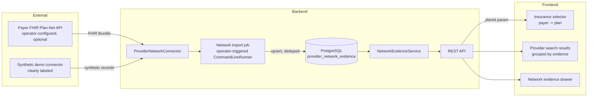

# Insurance network intelligence — architecture

Companion to `docs/insurance-network-research.md` (sources) and `docs/cost-intelligence-research.md`
(deferred). This document is the implementation spec for `feature/insurance-network-intelligence`.

## Product framing

DocFit AI already answers "which cardiologists are near me?" This phase adds: "which of those
cardiologists have **evidence** of participating in my selected plan's network, where did that
evidence come from, and how fresh is it?" It is evidence, never a guarantee — see the banned/
allowed language list in `CLAUDE.md` §2, enforced in every DTO and every piece of UI copy below.

## Data flow



Provider search never calls a connector directly (`CLAUDE.md` §89). Evidence is always read from
`provider_network_evidence` in PostgreSQL; only the operator-triggered import job talks to a
connector.

## Domain model

```
payer (1) ──< insurance_plan (M) ──< plan_network >── (M) insurance_network (1) ── payer
                                                              │
provider (existing) ──< provider_network_evidence >── insurance_network
                                                     >── insurance_plan (nullable)
                                                     >── network_source
```

### `payer`
`id, code (unique), name, website, active, created_at, updated_at`. Represents a carrier DocFit
AI *knows about* — not an implied integration. The 8 existing `insurance_carrier` rows (Aetna,
Anthem Blue Cross, Blue Shield of California, Cigna, Kaiser Permanente, UnitedHealthcare,
Medicare, Medi-Cal) are migrated in as `payer` rows with no plans attached, i.e. they remain
exactly what they've always been: known carrier names, zero integration. The pre-existing
`insurance_carrier` table and `/api/insurance-carriers` endpoint are left in place (nothing reads
them for search-affecting behavior; removing them isn't necessary and risks an unrelated
regression) but are no longer used by the frontend's insurance selector, and `API.md` marks them
legacy.

### `insurance_plan`
`id, payer_id, plan_name, plan_type (HMO|PPO|EPO|POS|OTHER), state, external_plan_identifier,
active, source_id (nullable FK to network_source), created_at, updated_at`. `market` from the
prompt's field list was considered and dropped: nothing in this phase populates it reliably, and
an unpopulated column that's always null isn't worth adding (`CLAUDE.md`'s repeated "don't build
what isn't justified").

### `insurance_network`
`id, payer_id, network_name, external_network_identifier, state, active, created_at, updated_at`.

### `plan_network`
`plan_id, network_id` — composite PK. A plan can participate in more than one network (e.g. a
national plan with a state-specific network overlay); modeled as a real join table, not collapsed
into a string.

### `network_source`
`id, payer_id, source_type (FHIR_API|JSON_API|MACHINE_READABLE_FILE|MANUAL_DEMO_REFERENCE), name,
base_url_reference, format, active, last_successful_check, created_at, updated_at`.
`MANUAL_DEMO_REFERENCE` is the only source type ever active outside the `test` Spring profile by
default, and its evidence is always labeled `SYNTHETIC DEMO DATA` end-to-end (see "Demo data"
below) — it is never presented as if it came from a real payer.

### `provider_network_evidence`
The critical table:

`id, provider_id, insurance_network_id, insurance_plan_id (nullable), status, source_id,
source_provider_identifier, source_network_identifier, matched_address_line1, matched_city,
matched_state_code, matched_postal_code, match_method, first_seen_at, last_seen_at, checked_at,
source_last_updated_at (nullable), created_at, updated_at`.

**No separate `provider_location` table.** DocFit AI's `provider` table stores exactly one
address per NPI (see `docs/insurance-network-research.md`, "Location model"). Rather than build a
speculative multi-location table nothing else uses yet, the matched address is snapshotted
directly onto the evidence row. This still delivers real location-specific evidence (`CLAUDE.md`
§12): if a future multi-location provider import exists, a `provider_location_id` column can be
added additively without reshaping this table.

**Status is not `STALE`.** `STALE` is a *freshness qualifier* computed at read time from
`checked_at` and the configured freshness policy (`docfitai.insurance.freshness.*`), not a sixth
stored enum value — because passing time alone (no new observation) would otherwise force a
write to every affected row just to keep `status` accurate. `NetworkEvidenceStatus` stores:
`EVIDENCE_FOUND`, `NO_EVIDENCE_FOUND`, `SOURCE_UNAVAILABLE`, `MATCH_AMBIGUOUS`, `NOT_CHECKED`.
The API layer combines `status` + a computed `freshness` (`FRESH` / `AGING` / `STALE`, only
meaningful when `status = EVIDENCE_FOUND`) into the response.

**Match method** (`MatchMethod`): `NPI_EXACT`, `NPI_AND_LOCATION`, `NPI_AND_POSTAL_CODE`,
`ORGANIZATION_NPI`, `AMBIGUOUS`. Never hidden — every evidence response includes it, and the
provider detail evidence drawer shows it in plain language (e.g. "Matched by: NPI + practice
location").

**Deduplication** (`CLAUDE.md` §27): two partial unique indexes —
`(provider_id, insurance_network_id, insurance_plan_id, source_id) WHERE insurance_plan_id IS NOT NULL`
and `(provider_id, insurance_network_id, source_id) WHERE insurance_plan_id IS NULL` — so a
re-import upserts the same logical evidence row (bumping `last_seen_at`/`checked_at`/`status`)
instead of duplicating it.

**No separate history/audit table this phase** (`CLAUDE.md` §28): `first_seen_at` /
`last_seen_at` / `checked_at` capture the useful provenance questions ("when did we first see
this," "when did we last confirm it," "when did we last check at all") without a growing
observation-log table. If DocFit later needs "show me when this flipped from found to
not-found," that's an additive table, deferred until there's a real product need for it.

**No `network_import` table**: import provenance is logged (source, status, duration, counts —
never raw payloads, `CLAUDE.md` §49/§64), following the same pattern as the existing
`NppesImportRunner`, rather than adding a table nothing queries yet.

### Indexes
`provider_network_evidence(provider_id)`, `(insurance_network_id)`, `(insurance_plan_id)`,
`insurance_plan(payer_id)`, `insurance_network(payer_id)` — each justified by a query the service
actually runs (batch evidence lookup by provider IDs + plan; plan listing by payer).

## Freshness policy

Configurable, not hardcoded (`CLAUDE.md` §14):

```
docfitai.insurance.freshness.fresh-days=30
docfitai.insurance.freshness.aging-days=60
```

0–`fresh-days`: "Recently checked". `fresh-days+1`–`aging-days`: "Checked N days ago". Beyond
`aging-days`: "Evidence may be outdated" (`STALE`). These defaults are the ones suggested in the
prompt, made configurable per the explicit instruction not to hardcode them without being able to
change them; no claim is made that 30/60 are clinically or contractually meaningful thresholds.

## Connector architecture

```java
public interface ProviderNetworkConnector {
    String sourceCode();
    List<DiscoveredPlan> discoverPlans();
    List<NetworkParticipationRecord> fetchProviderNetworkParticipation(String npi);
    ConnectorHealth healthCheck();
}
```

- `MockNetworkConnector` — deterministic synthetic `Payer A / Plan A / Network A / Provider A`
  fixture, used only by backend tests (`CLAUDE.md` §41). Not registered as a Spring bean in
  normal `dev`/`prod` profiles.
- `DemoNetworkConnector` — the one connector active by default. Returns a small, fixed,
  synthetic evidence set for a payer named `"DocFit Demo Network (synthetic test data)"`, backed
  by a `network_source` row with `source_type = MANUAL_DEMO_REFERENCE`. Every evidence record it
  produces is rendered in the UI with a visible "SYNTHETIC DEMO DATA" badge — this is the
  `CLAUDE.md` §42 exception ("Optionally enable mock network evidence only in: test profile...
  Never normal development UI unless explicitly labeled: SYNTHETIC DEMO DATA"), used deliberately
  so the signature feature is demonstrable without a live payer integration and without ever
  implying real coverage.
- `FhirPlanNetConnector` — real Da Vinci Plan-Net client (`PractitionerRole`/`Practitioner`/
  `Location`/`InsurancePlan` FHIR R4 resources over plain REST + Jackson; no HAPI FHIR dependency
  — the resource subset DocFit needs is narrow enough that a full FHIR client library would be
  more risk than it removes, see `CLAUDE.md` §22). Only activates when
  `docfitai.insurance.fhir-plan-net.base-url` is set by the operator (never user input — SSRF
  rule, `CLAUDE.md` §80); unset by default. Bounded connect/read timeouts, retries only on
  429/5xx/connection failure with capped backoff (`CLAUDE.md` §45–46). No circuit breaker
  library was added: with no live connector wired up by default, adding Resilience4j now would
  be infrastructure with nothing depending on it yet (`CLAUDE.md` §47 — "do not add just for
  architecture theater"); the bounded timeout + bounded retry already prevents a hung or flaky
  source from blocking the (operator-triggered, offline) import job, which is the only caller.

Import is **operator-triggered**, not a live per-search-request call (`CLAUDE.md` §89): a
`NetworkEvidenceImportRunner` (`CommandLineRunner`, gated behind the `network-import` Spring
profile, mirroring the existing `NppesImportRunner` pattern) reads a connector's
`fetchProviderNetworkParticipation` for DocFit's imported providers and upserts
`provider_network_evidence`.

## Evidence lookup service

`NetworkEvidenceService`:
- `Map<Long, EvidenceSummary> summarizeForProviders(List<Long> providerIds, Long planId)` — one
  batched query, used by provider search to avoid N+1 (`CLAUDE.md` §89–91).
- `NetworkEvidenceDetail lookup(Long providerId, Long planId)` — full detail for the evidence
  drawer, including limitations text.

Both always return a result — `SOURCE_UNAVAILABLE`/`NOT_CHECKED` are real statuses precisely so a
missing/broken source never turns into a provider-search failure (`CLAUDE.md` §44).

## API surface

- `GET /api/insurance/payers` — payer list (`id, code, name, hasIntegratedPlans`).
- `GET /api/insurance/payers/{id}/plans` — plans for a payer (empty array if none integrated).
- `GET /api/providers/{id}/network-evidence?planId=` — full evidence detail.
- `GET /api/providers/search?...&planId=` — existing search, now optionally annotated with a
  compact evidence summary per result when `planId` is present. Backward compatible: omitting
  `planId` changes nothing about the existing response shape's required fields.

`/api/insurance-carriers` (legacy) is untouched.

## Frontend states (`CLAUDE.md` §71)

Insurance selector: no payer selected · payer selected, no integration · plan selected · evidence
loading · evidence found (fresh/aging/stale) · no evidence found · source unavailable · ambiguous.
Each has distinct, factual copy — never "in network" / "out of network" — and status is conveyed
with an icon + text, never color alone (`CLAUDE.md` §72, §74).

## Privacy

Plan selection lives in the URL query string (`planId`), exactly like `specialty`/`location`
already do — never persisted server-side automatically. "Save my plan" (`CLAUDE.md` §18) is
**deferred**: the prompt itself says to defer it if it complicates the privacy architecture, and
building a second opt-in, user-scoped, deletable preference table is real scope on top of an
already large phase; it's flagged in the final report as next-phase work rather than rushed in.

## Data retention

- **Network evidence** (`provider_network_evidence`): retained indefinitely per (provider,
  network, plan, source) key, but never duplicated -- each re-import updates the existing row in
  place (see "Deduplication" above) rather than accumulating history. Deleting a provider or
  network source would need an explicit follow-up decision; none exists yet because nothing in
  this phase deletes providers.
- **Connector logs**: only source/status/duration/counts are logged (`CLAUDE.md` §64) -- no raw
  response payloads are persisted anywhere, so there is nothing extra to retain or purge beyond
  normal application log rotation.
- **Import records**: no separate `network_import` table exists (see above), so there is nothing
  additional to retain.
- **Saved plans**: not implemented this phase (see "Privacy" above) -- no retention question
  exists until it is.

## Security review notes (`CLAUDE.md` §79)

- **SSRF**: no endpoint accepts a URL from a request. `FhirPlanNetConnector`'s base URL comes only
  from `docfitai.insurance.fhir-plan-net.base-url` (server-side configuration/env var).
- **Secrets**: the FHIR connector doesn't currently require credentials (Plan-Net directory APIs
  are designed for unauthenticated read access); if a future source needs a key, it must be an
  env var following the existing `JWT_SECRET`-style pattern, never committed.
- **SQL injection**: all new queries are Spring Data JPA derived/`@Query` methods with bound
  parameters, or JPA entity access -- no string-concatenated SQL was added.
- **Authorization**: network evidence is public (no member data involved), matching the existing
  `permitAll` pattern for provider search; nothing new is added to authenticated endpoints in this
  phase.
- **CORS/cookies**: unchanged -- no new cross-origin surface was introduced.

## What this phase explicitly does not build

Claims ingestion, member eligibility/IDs, cost/price data model (research only), admin dashboard,
data-correction reports, AI/probabilistic coverage scoring, multi-tenant B2B config (see
`docs/b2b-pilot-notes.md`), circuit breaker, custom Micrometer metrics (the existing Actuator
setup is unchanged; adding `docfit.network.*` counters is listed as follow-up work rather than
built against a connector that isn't live by default).
