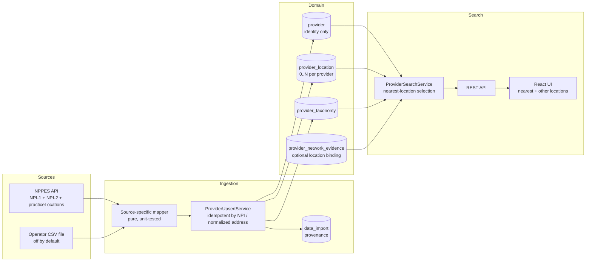

# Provider Data Platform V2 — multi-location architecture

Companion docs: `docs/provider-ingestion.md` (importers), `docs/geospatial-scaling.md` (distance
query scaling). This document covers the schema/service/API/frontend redesign that moved DocFit
AI from "one address per provider" to genuine multi-location support.

## Why this was the top-priority fix

The prior architecture stored exactly one address/phone/coordinate directly on the `provider`
row. That's not how healthcare providers actually work: a real NPI can have (and, per this
phase's live NPPES import, commonly does have) multiple practice locations, and network
participation, distance, and contact details can legitimately differ by location. Search results
and provider detail needed to model that reality without becoming confusing (CLAUDE.md's "final
principle").

## Data flow

## Schema: before / after

**Before**: `provider(id, npi_number, first_name, last_name, organization_name, phone,
address_line_1, address_line_2, city, state_code, postal_code, latitude, longitude, imported_at)`
— identity and location conflated into one row.

**After**:
- `provider(id, npi_number, entity_type, first_name, last_name, organization_name, imported_at)`
  — identity only. The legacy address/phone/coordinate columns still physically exist (loosened
  to nullable) but are unused by the application — see "Migration strategy."
- `provider_location(id, provider_id, address_purpose, address_line_1, address_line_2, city,
  state_code, postal_code, country_code, phone, fax, latitude, longitude, coordinate_precision,
  is_primary, normalized_key, source_last_updated_at, created_at, updated_at)` — zero to many per
  provider.

## Migration strategy (staged, per CLAUDE.md 7)

**Stage A (this phase, `V8__create_provider_location.sql`)**: additive and loosening only.
1. Create `provider_location`.
2. Backfill one row per existing provider from its current single address (`coordinate_precision`
   truthfully set to `ZIP_CENTROID` when coordinates exist, since that's genuinely how they were
   derived — a `zip_geography` lookup, never a real geocode).
3. Add `provider.entity_type`, backfilled from `organization_name IS NOT NULL` (accurate for
   today's data, since the importer had only ever fetched individuals before this phase).
4. Loosen (`DROP NOT NULL`, never drop the column) the now-unused `provider.address_line_1`,
   `city`, `state_code`, `postal_code` columns, so new provider rows — which the application no
   longer populates directly — don't violate a constraint nothing sets anymore.
5. Add `provider_network_evidence.provider_location_id` (nullable) and rebuild its dedup unique
   indexes to include it, so the same provider/network/plan/source combination at two different
   locations is two distinct evidence rows, not a collision.

No existing account, saved-provider, saved-search, or evidence row was destroyed by this
migration — it was run against the real, previously-populated local database during this phase
(not just a fresh Testcontainer) and verified live: existing saved providers, existing evidence
rows, and existing accounts were all unaffected (see the final report's manual verification
section).

**Stage B (explicitly deferred, not built this phase)**: drop the now-unused legacy `provider`
address/phone/coordinate columns once the application has run against Stage A for a while and
nothing is found to still depend on them. This is a separate, low-risk, purely-destructive-of-
already-unused-columns migration — deliberately not bundled into the same step as the
identity/location split, per CLAUDE.md's explicit instruction to avoid one dangerous all-at-once
migration.

## Location uniqueness

`LocationNormalizer.normalizedKey(addressLine1, addressLine2, city, stateCode, postalCode)`:
uppercase, trim, collapse whitespace, strip periods/commas, base ZIP5 — joined with `|`.
Deliberately minimal (CLAUDE.md 5, 38), not a USPS-grade standardizer. A database unique index on
`(provider_id, normalized_key)` enforces it; the SQL expression that backfilled existing rows in
`V8` was written to compute the identical key, so a re-import of an already-known provider's
existing address updates that same row instead of creating a duplicate — verified live (see
`docs/provider-ingestion.md`, "Real import results": the second live NPPES import run created
zero new locations for the 502 already-known providers). Phone number is explicitly **not** part
of the identity key (CLAUDE.md 5) — the same office changing its phone number updates the
existing location row rather than creating a new one.

## Location precision

`CoordinatePrecision`: `EXACT`, `ADDRESS_GEOCODE`, `ZIP_CENTROID`, `CITY_CENTROID`, `UNKNOWN`.
Every coordinate DocFit AI currently produces (NPPES import via `zip_geography` lookup) is
labeled `ZIP_CENTROID`, surfaced to the frontend and never presented as an exact address position
— "Why this result?" and the provider detail page both show a location-precision note when
applicable (CLAUDE.md 43-44).

## Search behavior

For each provider matching the requested specialty, `ProviderSearchService` now:
1. Joins `provider` × `provider_taxonomy` × `npi_taxonomy` × `provider_location` in one query.
2. Tracks, per provider, the best-matching taxonomy (primary preferred, same rule as before) and
   the *nearest* location whose distance is within the requested radius — independently, since
   taxonomy match doesn't depend on which office is nearest.
3. Returns each qualifying provider exactly once, attached to that nearest location.

Verified live against a real organization with 41 practice locations: it appears exactly once in
search results, at its nearest office (see `docs/provider-ingestion.md`). Pagination
(`totalElements`/`totalPages`) counts distinct providers, never location rows, by construction —
the in-memory result list already has one entry per qualifying provider before pagination slicing.

## Provider detail

Returns `location` (the nearest location to the search origin when one was given, else the
primary location) and `otherLocations` (every remaining location, never duplicating `location`).
Each location carries its own phone/address, so Call and Directions always act on the specific
office being shown — never a stale provider-level address (CLAUDE.md 15-16).

## Network evidence + locations

`provider_network_evidence.provider_location_id` is nullable and populated only when
`NetworkEvidenceImportService` can deterministically match a source's reported address against
one of the provider's known locations (same rule as before, now per-location rather than
per-provider: `NPI_AND_LOCATION` when address+city+postal all match a specific
`ProviderLocation`, `NPI_AND_POSTAL_CODE` when only postal matches, else `NPI_EXACT`/provider-wide).
`NetworkEvidenceService` prefers evidence bound to the exact location a search result or detail
page is showing; falls back to provider-wide (no-location) evidence; and — the one added nuance —
if the caller has no specific location context at all and every remaining evidence candidate
happens to point at the same single location, it's shown anyway (unambiguous); but evidence is
never guessed across two *different* locations (CLAUDE.md 9).

## Saved providers / comparison / name search

All three continue to key off provider identity (unchanged, CLAUDE.md 17-18). Saved providers and
name search show the provider's **primary** location (no search-origin/distance context exists
there). Comparison shows whichever location the search result it was launched from was showing,
labeled "Practice location shown" so it's never ambiguous which office is being compared
(CLAUDE.md 18).

## Frontend

`ProviderLocationDto` is now nested on every provider-shaped API response
(`ProviderSearchResultDto.location`, `ProviderDetailDto.location`/`.otherLocations`,
`SavedProviderDto.location`). Provider detail adds an "Other locations" section, each with its
own Call/Directions actions and a location-precision note when the coordinates are ZIP-level
approximate. "Why this result?" gained the same precision note. Organization providers display
their organization name (never "null null") via the existing `providerDisplayName` helper, now
covered by a dedicated unit test.

## Production safety: synthetic insurance data (CLAUDE.md 26-27, 62)

`DemoNetworkEvidenceSeeder` is now gated behind `docfitai.insurance.synthetic-demo.enabled`
(`DOCFIT_SYNTHETIC_INSURANCE_ENABLED`), **default `false` everywhere** — dev, prod, and the test
suite all leave it off. With the flag absent, the seeder bean doesn't even exist in the Spring
context (`@ConditionalOnProperty`), verified by a dedicated regression test
(`SyntheticInsuranceDataSafetyTest`). The static payer/plan/network reference rows (V7 migration)
remain always-present, harmless metadata — only the fabricated per-provider evidence is gated.

## Retention

No new retention question beyond what `docs/insurance-network-architecture.md` already documents.
`data_import` rows accumulate one per run (counts only, no raw payloads) — bounded by how often an
operator runs an import, not by user activity.

## Security review

- **SSRF / arbitrary file read**: the CSV importer's source directory is server-side
  configuration only (`docfitai.import.csv.source-directory`); no endpoint accepts a file path or
  URL from a request. No new HTTP endpoints were added by this phase's importers at all — both
  are `CommandLineRunner`s, not web-reachable.
- **SQL injection**: all new/changed queries are parameterized (`NamedParameterJdbcTemplate` /
  JPA derived queries / bound `JdbcTemplate` placeholders); no string-concatenated SQL.
- **Authorization**: unchanged — provider search/detail remain public; saved-provider/search
  authorization tests still pass unmodified against the new schema.
- **Synthetic data leakage into production**: covered above; explicit regression test added.
